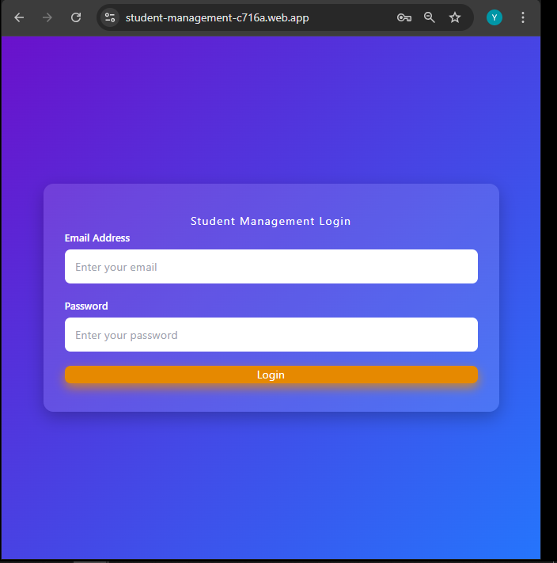
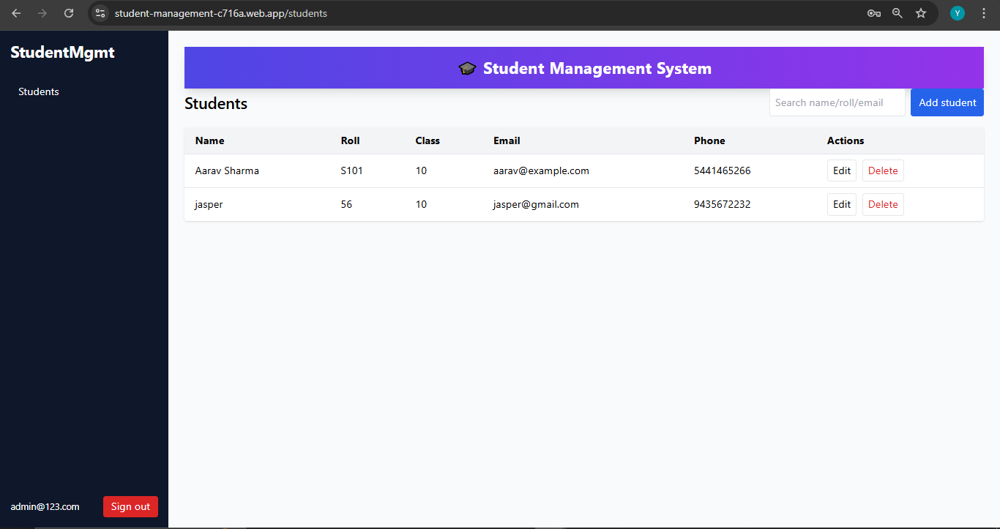
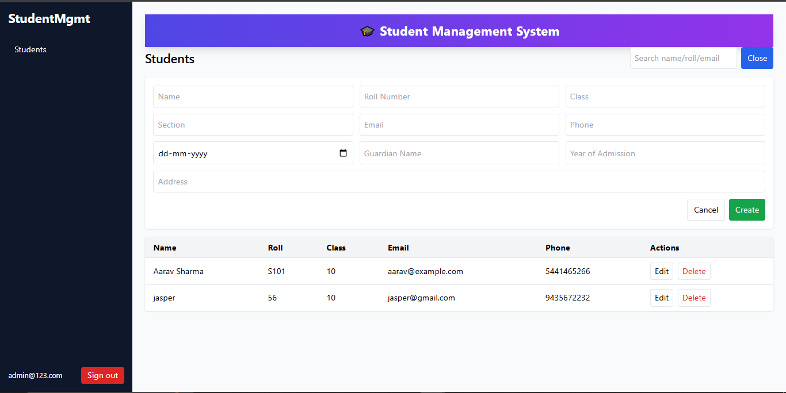
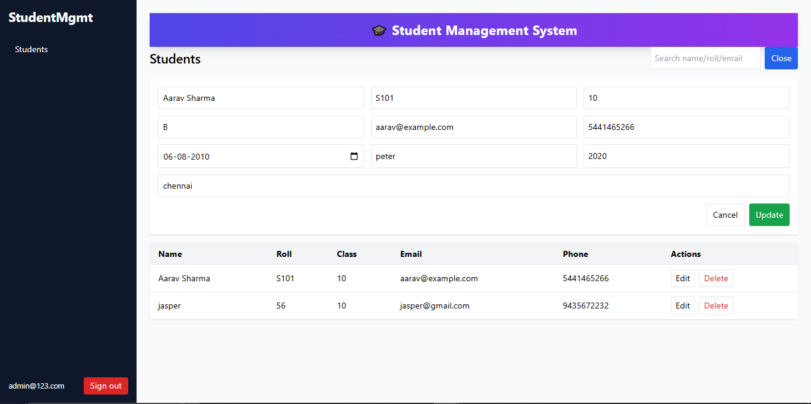

# Student Management System

A simple and secure student management application built with **React** and **Node.js**, featuring authentication, role-based access, and a clean user interface.

## 🚀 Features

* **User Authentication** – Secure login system with protected routes
* **Student Records** – Add, edit, and view student details
* **Responsive Layout** – Sidebar navigation and clean design using Tailwind CSS
* **Protected Pages** – Only logged-in users can access certain routes
* **Reusable Components** – Organized code structure for easy maintenance


##  Live Demo & Login Credentials

You can try out the app live:  
[Live Demo](https://student-management-c716a.web.app/students)

**Use the following credentials to log in:**
 
| Field    | Value               |
|----------|---------------------|
| Email    | `admin@123.com` |
| Password | `admin123` |


## 🛠 Tech Stack

**Frontend**

* React
* React Router
* Tailwind CSS

**Backend**

* Node.js / Express
* PostgreSQL 

## 📂 Project Structure

```
project-root/
│
├── frontend/         
│   ├── src/
│   │   ├── components/
│   │   ├── pages/
│   │   ├── contexts/
│   │   ├── App.js
│   │   └── index.js
│
├── backend/          
│   ├── routes/
│   ├── controllers/
│   ├── models/
│   └── server.js
│
└── README.md
```

### Clone the repository

```bash
git clone https://github.com/YazhiniVenkatesan12/Student-Management-System.git
```

## 📷 Screenshots

## Login Page


## Dashboard

##




## 📝 License

This project is licensed under the MIT License – you’re free to use, modify, and distribute it.

---
